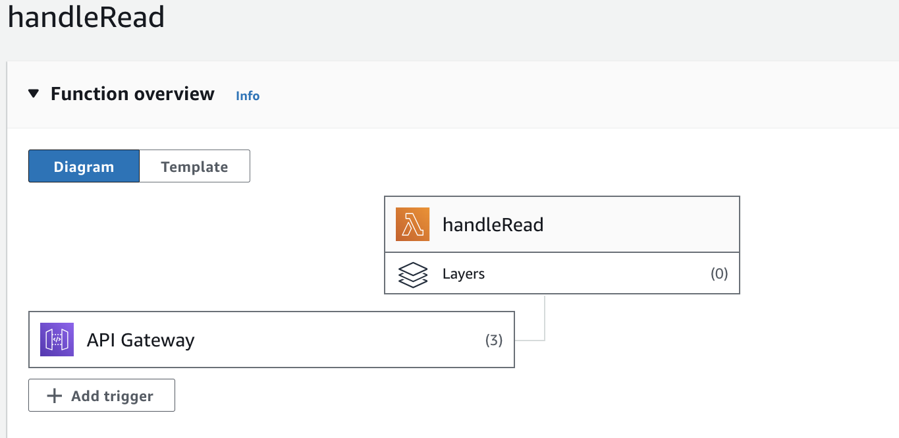
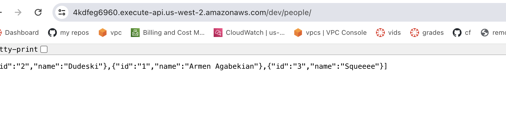
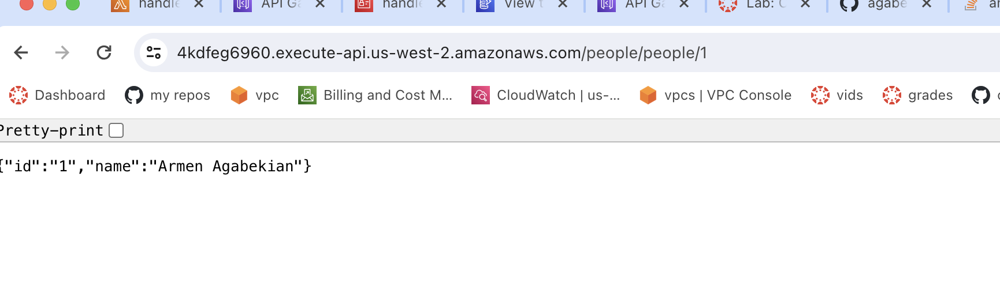

# serverless-api

#### notes:
Create api Gateway router

Create Lambda(s). Choose test environments. Deploy/

Add permissions if none for DB.

Add permissions dropdown:   attach policy  . Then search/select/add

Recycle a “master” permission for new _method_ lambda(s), so it can access dynamoDB etc. 

Connect "routes" to lambdas

Stages : like a branch, so DEV for all

Crete new METHOD(not resource) while clicking on people/ entry  for methods, etc

GET people/

GET people/{id}
